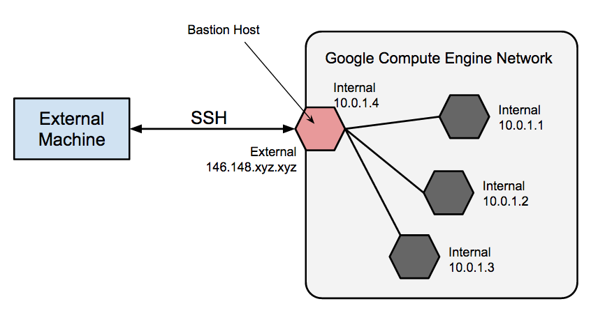

# Bastion Hosts & VPC Peering

## Agenda

- Bastion Hosts / Jump Server
- DNS Setup
  - Public Hosted Zones
  - Private Hosted Zones
  - Hosted Zones for Subdomains
- VPC Peering
- Building Scalable & Reliable Systems

## Reading

### Bastion Hosts

- [Bastion host](https://en.wikipedia.org/wiki/Bastion_host)
- [Linux Bastion Hosts on AWS](https://aws.amazon.com/solutions/implementations/linux-bastion/)
- [Bastion Host - Google Cloud](https://cloud.google.com/solutions/connecting-securely#bastion)

### VPC Peering

- [VPC Peering (AWS)](https://docs.aws.amazon.com/vpc/latest/peering/what-is-vpc-peering.html)
- [VPC Network Peering (GCP)](https://cloud.google.com/vpc/docs/vpc-peering)

### Building Scalable & Reliable Systems

- [Building Secure and Reliable Systems](https://sre.google/books/building-secure-reliable-systems/)

## Lecture Notes

- We can peer with multiple VPCs by VPC peering.
- Every VPC we want to peer with must have a unique CIDR (IPv4 and IPv6) range.

## DNS Setup - Route53

- 1 domain (TLD) per person (csye7125.cloud)
- `dev` and `prod` sub-domains (dev.aws.csye7125.cloud and prod.aws.csye7125.cloud)
- dev.gcp.csye7125.cloud, prod.gcp.csye7125.cloud, and more sub-domains (like k8s.prod.aws.csye7125.cloud)
- These are all in the public hosted zones.
- Public HZ is to resolve all domain names that are accessible through the internet, but we can also include private subnets that are private to our VPC network only.
- tailscale.com -> peer to peer, etc. -> based on wire protocol -> kind of like a VPN solution.

## Scalability and Reliability

- Distributed systems -> not everything or transactions happens in real-time -> everything is mostly done asynchronously.
  - Ex: Sending a like on Twitter, which is not an immediate transaction, it can take some time to show up.
- MVC pattern
- Scale vertically and horizontally
- Scale out:
  - load balancer
  - stateless services
- Something between app server and db server which will reduce the load on the db.
- Scale db with caching -> "distributed caching" in the scale out service -> for data that is frequently read and rarely changed.
- Have multiple processing tiers -> scale various services that interact to process a request.
