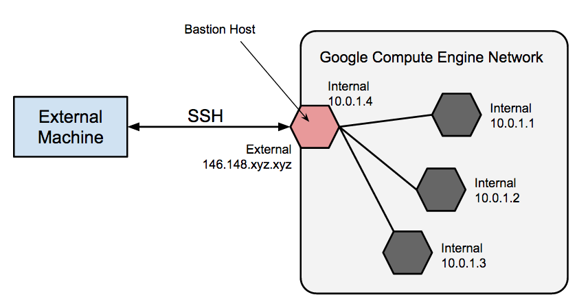

# Bastion Hosts & VPC Peering

## Agenda

- Bastion Hosts / Jump Server
- DNS Setup
  - Public Hosted Zones
  - Private Hosted Zones
  - Hosted Zones for Subdomains
- VPC Peering
- Building Scalable & Reliable Systems

## Reading

### Bastion Hosts

- [Bastion host](https://en.wikipedia.org/wiki/Bastion_host)
- [Linux Bastion Hosts on AWS](https://aws.amazon.com/solutions/implementations/linux-bastion/)
- [Bastion Host - Google Cloud](https://cloud.google.com/solutions/connecting-securely#bastion)

### VPC Peering

- [VPC Peering (AWS)](https://docs.aws.amazon.com/vpc/latest/peering/what-is-vpc-peering.html)
- [VPC Network Peering (GCP)](https://cloud.google.com/vpc/docs/vpc-peering)

### Building Scalable & Reliable Systems

- [Building Secure and Reliable Systems](https://sre.google/books/building-secure-reliable-systems/)

## Lecture Notes



- We can peer with multiple VPCs by VPC peering.
- Every VPC we want to peer with must have a unique CIDR (IPv4 and IPv6) range.

## DNS Setup - Route53

- 1 domain (TLD) per person (csye7125.cloud)
- `dev` and `prod` sub-domains (dev.aws.csye7125.cloud and prod.aws.csye7125.cloud)
- dev.gcp.csye7125.cloud, prod.gcp.csye7125.cloud, and more sub-domains (like k8s.prod.aws.csye7125.cloud)
- These are all in the public hosted zones.
- Public HZ is to resolve all domain names that are accessible through the internet, but we can also include private subnets that are private to our VPC network only.
- tailscale.com -> peer to peer, etc. -> based on wire protocol -> kind of like a VPN solution.

## Scalability and Reliability

- Distributed systems -> not everything or transactions happens in real-time -> everything is mostly done asynchronously.
  - Ex: Sending a like on Twitter, which is not an immediate transaction, it can take some time to show up.
- MVC pattern
- Scale vertically and horizontally
- Scale out:
  - load balancer
  - stateless services
- Something between app server and db server which will reduce the load on the db.
- Scale db with caching -> "distributed caching" in the scale out service -> for data that is frequently read and rarely changed.
- Have multiple processing tiers -> scale various services that interact to process a request.

## Jenkins

```dockerfile
FROM jenkins/jenkins
ENV JAVA_OPTS _Djenkins.install.runSetupWizard=false
ENV CASC_JENKINS /var/jenkins_home/casc.yml
# configuration as code file -> for passwords and user credentials mgmt
# these can be configured using Mozilla SOPS, but that causes server restart to add more credentials
# so it is recommended to use an external store since we can just add more credentials as we need them without restarting our servers
# plugins file to install plugins -> for consistency
COPY pluginfile.txt /usr/share/jenkins/ref/plugins.txt
RUN jenkins-plugin-cli --plugin-file /usr/share/jenkins/ref/plugins.txt
COPY casc.yaml /usr/share/
```

```txt
job-dsl:latest
# add script from job-dsl and add own groovy script to setup job
seed job -> look for `file` in `location`
```

## Working with Kubernetes

Need for orchestration:
- Monolithic to microservices
- rapid release cycles
- devops to noops
- deployments at much larger scale
- provide consistent env for apps
- need to use resources efficiently

LB helps in service discovery
LB talks to EC2 instance -> performs health check -> bring in auto scaler if instance is unhealthy -> to replace unhealthy instance

TODO: Linux Namespaces
TODO: Split Brain problem

### Pods

- Co-located group of containers, basic building block of k8s.
- Side cart container design pattern
- Pods have flat inter-pod network, containers in a pod can talk to other containers in another pod, which is not secure.
- Pods are organized using `tags`.

### Namespaces

- Use namespaces to group resources. There are `kube-*` namespaces that are for the `control-plane` work load only, which are reserved for k8s.
- Provides a scope for objects names.
- Spearate name space for `ops` and separate namespace for `dev` stuff.

### Liveness Probes

- These are used to check if a container is still alive.
- These are optional (in pod specifications).
- If this fails, the container will be restarted.
- Need to implement restart logic in our probes.

### Replication controllers

- K8s resource which monitors all pods and see if any pod is missing, to replace that pod.
- This is again based on labels, and reconciles based on the tags defined, in a cluster.
- Launch pods through higher order resources like `replication controller`
- This is oder logic on how it manages labels.
- This is present for backwards compatibility.

### ReplicaSets

- Similar to replica controllers, but have enhanced logic to manage labels/tags.

### DaemonSets

- Makes sure every node has one pod running.
- Example: log collection sets, metric collection sets 

### Job resource

- Cron jobs, but in k8s.
- Maintains a history automatically, but can be configured as well.

### Services

- Availibility for clients to discover and talk to pods.
- Helps with service discovery which eliminates the requirements for load balancers.
- Discovery through environment variables, DNS, FQDN.
- Pods are ephemeral -> they come and go at any time.

> Design your application for failure

### Readiness Probes

- App is healthy, but it is still initializing and is not ready to serve traffic
- Ensures unhealthy containers are restarted automatically to keep application healthy.
- Invoked periodically to check if a specific pod should receive client requests or not.
- It does not restart the container.
- 3 Types:
  - `Exec` probe
  - `HTTP GET` probe
  - `TCP Socket` probe

### Volumes

- _TODO_

### ConfigMap

- plain text in `etcd`

### Secrets

- encrypted text in `etcd`

### Deployment Resource

- Pods management
- Perform rolling updates
- Revert updates in pods
- Delete and replace old with new pods

### Stateful Sets

- db servers -> to maintain state (not ephemeral)
- Can have more than one replica of a statefulset.
